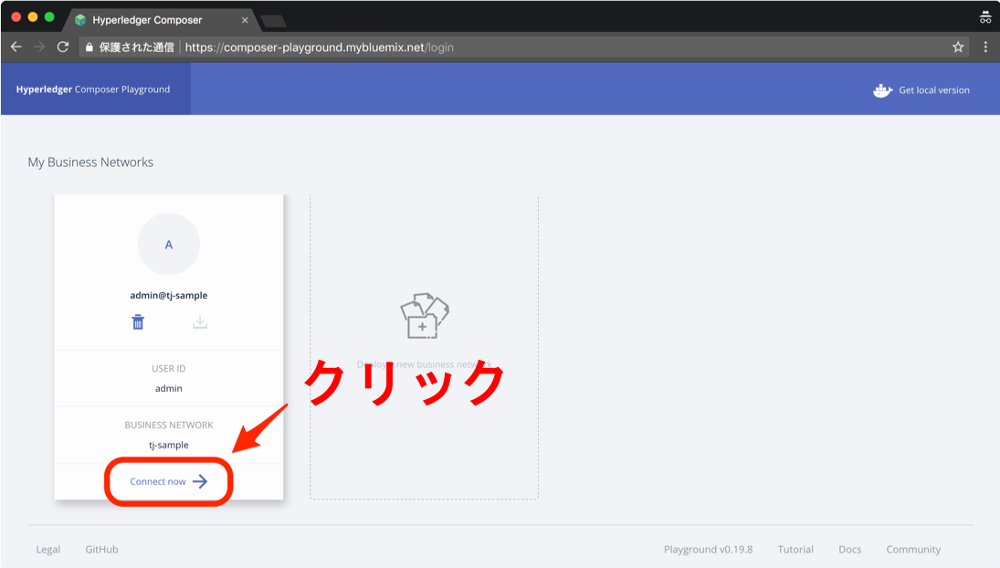
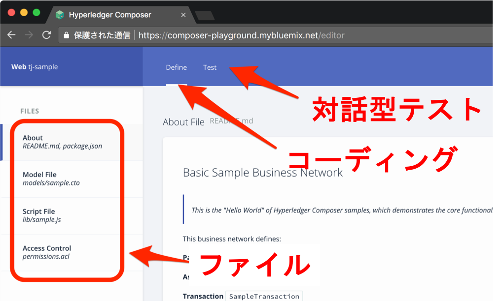

# Blockchain Hands-On

## 本資料について

2018年8月28・29日開催のイベント、[**Research Experience Day**](https://ibm-research-experience.connpass.com/) のDay2 午後のセッション [体験しよう！ブロックチェーン -その仕組みから実践まで-](https://ibm-research-experience.connpass.com/event/95083) のハンズオン資料である。

ドキュメントをブラウザで見る場合は https://github.com/shinsa82/red-handson を参照のこと。サンプルコードを含むソースをすべてダウンロードしたい場合は https://github.com/shinsa82/red-handson.git を `git clone` すること。

```bash
git clone https://github.com/shinsa82/red-handson.git
```

## ハンズオンの進め方

説明する内容はすべてここに書いてあるので、先に進みたい方は本資料をもとに進めてもらって構わない。また、機材のトラブルなどで遅れても、この資料をもとに追体験できるのでご心配なきよう。

## 予定所要時間

1時間 (当該セッションの後半)

## 講師

日本アイ・ビー・エム株式会社 東京基礎研究所 齋藤 新・岩間 太・榎 美紀

# 1. 講習内容

## 1.1 概要

パーミッション型のブロックチェーン実装である、Hyperledger Fabricにおけるスマートコントラクト開発の概要について学ぶ。

- 開発フレームワークとしてはHyperledger Composer (以下、Composer) を使用する
- 開発プラットフォームとしてWeb上で動作するComposer Playground (以下、Playground) を使用する

## 1.2 Composerを使用するメリット

- 低レベルのコード (KVSへの読み書きやデータのmarshallingなど) を書かなくてよい
- アクセス制御の宣言的な設定が可能
- Webシミュレータやモックオブジェクトなどを用いて、実際にスマートコントラクトをデプロイすることなくテストができる
- フロントエンド開発支援が充実。サーバ環境やAngularJSコンポーネントの自動生成ができる

## 1.3 Playgroundを使用するメリット

- エディタを含む開発環境のインストールが不要 (もちろんインストールしたほうが便利である)
- 簡単な対話的テスト (トランザクションを作成・発行してKVSの更新を閲覧すること) が可能。なお、本格的なテストはローカル環境で行う (2.7)。

# 2. ComposerとPlaygroundによる開発フロー

詳細については当該セクションを参照のこと。各セクションには練習問題があるので挑戦してみてほしい。後半の2つについてはインストールなどの必要な作業があるので、余裕があったら行うか、後日この資料をもとに取り組んでみてほしい。

- 2.1 Playgroundでサンプルをもとに新規Business Netoworkを作成してみる
- 2.2 Business Netoworkとダッシュボードの構成要素
- 2.3 試しにトランザクションを実行してみる (対話的テスト)
- 2.4 アプリケーションの中身を理解してみる (Model File)
- 2.5 アプリケーションの中身を理解してみる (Script File)
- 【省略】アプリケーションの中身を理解してみる (Access Control)
- 2.6 コードを書き換えてみる
- 2.7 (要ローカル環境) スクリプトによる単体テストの実行

## 2.1 Playgroundでサンプルをもとに新規Business Netoworkを作成してみる

必要なもの: モダンブラウザ

1. https://composer-playground.mybluemix.net をブラウザで開く (HTTPS版のページを開くことを推奨)
2. "Let's Blockchain!" を押す 
    1. もし `Error: Object with ID 'undefined' in collection with ID 'chaincodes' does not exist` というエラーなどが表示される場合は https://composer-playground.mybluemix.net/login をリロードしてみる
1. 1つか複数の白い四角が表示される。それぞれがアプリケーション (Composerでいう "Business Network") である。
1. いちばん左のアプリケーション (Hello! Composerなどと書いてある) の `Get Started` もしくは `Connect now` を押す。 
1. "Basic Sample Business Network" のダッシュボードが表示される

なお、新しくBusiness Networkを追加したい場合は[こちら](docs/new-app.md)

## 2.2 ダッシュボードとBusiness Networkの構成要素

前の画面に戻るには、右上の `admin` をクリックして、出てきた `My Business Networks` をクリックする。

### 2.2.1 ダッシュボード



上部にはタブが2つある。

- Define: Business Networkの構成要素であるParticipant、Asset、Transaction、EventおよびAccess Control Listを定義する (2.3)
- Test: Defineタブで定義したBusiness Networkを対話的にテストする (2.4)

### 2.2.2 Business Network

Defineタブで定義する。基本的にはNode.jsのプロジェクト構成と類似。左のナビゲーションで編集するファイルを切り替える:

- 初期状態では `About` でBusiness Networkの概要 (README.mdファイル) が表示されている。右上の "<>" をクリックすると `README.md` のソースファイルが表示される。歯車マークをクリックすると `package.json` のソースが表示される。
- `Model File` ではParticipant、Assetなどのデータ型を定義する。Transactionの引数の型もここで定義する。正しく書けていれば、エディタ下部に "Everything looks good!" を表示されている。エラーがあれば "Error found!" が表示される。
- `Script File` ではTransactionの処理内容 (= ビジネスロジック) をNode.jsの関数として定義する。エラー表示については上と同様。
- `Access Control` ではアクセス権について (ほぼ) 宣言的に定義する。「どの **Participant** がどのような **Resource** (Assetなど) にどのような **Operation** (READ、CREATEなど) ができるか」を記述していく。

ソースを編集したら左下の "Deploy Changes" をクリックするとアプリケーションが更新され、前述のTestタブで試すことができる。


また、作成したBusiness Networkは "Export" ボタンからBNAファイルとしてセーブすることができ、Fabricのネットワークにデプロイ可能である。


> 注意: Playgroundで作成したアプリケーションはセッションが切れたりすると消えてしまうので、保存したい場合はこまめにセーブしておくこと。

## 2.3 試しにトランザクションを実行してみる (対話的テスト)

必要なもの: モダンブラウザ

アプリケーションの中身の説明は後回しにするとして、まずはTestタブでのトランザクションの実行を試してみる。**これができればとりあえずは「コードを編集」→「対話的テスト」のサイクルを回せるようになる。**

1. Testタブを開く。左のナビゲーションをクリックすることにより、Participant、Asset、Transaction (以下、TX) のレジストリの内容を表示できる。
ただし前者2つは空である。TXだけは例外で、今回編集するサンプルアプリはすでにデプロイされているので、そのTransaction履歴が表示される。
1. Participantを作成する。`SampleParticipant` をクリックし、右上の `+ Create New Participant` をクリックする。
1. 新しい `SampleParticipant` インスタンスの値を決める。IDは自動で振られるが、決まった値を使ったほうが楽なのでここでは `"0001"` に設定。残りのフィールドは適当に設定。下部の `Generate Random Data` で自動生成もできる。右下の `Create New` をクリック。
1. レジストリにインスタンスが追加されたことがわかるはず。
1. 次にAssetを作成する。`SampleAsset` をクリックし同様に `+ New ...` する。
1. 新しい `SampleAsset` の値を決める。ここでもIDは決め打ちで `"0001"` とするのが楽。エンティティの種類が違うのでID被りは問題にならない。`owner` 値は `"resource:<クラス名>#<ID値>"` の形式を取る。さきほど作成したParticipantを参照したいので、`"resource:org.example.basic.SampleParticipant#0001"` を指定する。`value` はなんでもよいがここでは `"100"` としておく。できたら `Create New` をクリック。
1. レジストリにインスタンスが追加されたことがわかるはず。このとき、`value` 値が `"100"` であることを確認しておく。
1. ちなみにここまで行ったのちに `All Transactions` をクリックすると、さきほどエンティティを追加したときのTXが先頭に新たに表示されているはず。
1. いよいよTXの実行。どのページにいてもいいので、左下の `Submit Transaction` をクリック。 
1. 一般には `Transaction Type` を選択する必要があるが、今は1種類のTXしか存在しないので選ばなくてよい。
1. TXの引数を決める。`asset` は先ほど追加したAssetを参照したいので `"resource:org.example.basic.SampleAsset#0001"` とする。`newValue` は何でもよいのでここでは `"1"` としておく。入力したら `Submit` をクリック。
1. 正常に完了すれば画面右上にnotificationが出るはず。
1. TX履歴に新たに `SampleTransaction` が追加されているはず。
1. Assetも更新されているはず。左側の `Sample Asset` をクリック。IDが `"0001"` のAssetがあり、その `value` 値は初期値の `"100"` から `"1"` に変更されていることがわかるはず。

### 2.3.1 演習

- Asset作成時に、`owner` にエンティティとして存在しないIDを指定したらどうなるか確認する
- Asset作成時に、`owner` にすでに存在するエンティティのIDを指定したらどうなるか確認する
- TX実行時に、`asset` に存在しないAssetを指定したらどうなるか確認する

## 2.4 アプリケーションの中身を理解してみる (Model File)

ではアプリケーションを理解するために、Model Fileを見てみる。Defineタブに切り替えた後、 `Model File` をクリックする。

ここではまず、名前区間が宣言されている:

```
namespace org.example.basic
```

すべてのモデルファイルはそれぞれの名前空間を持つ必要がある。

### 2.4.1 Participant


Participantはユーザを表す。これはHyperledger Fabricのユーザと対応しており、この情報をもとに、アクセスが制御される。

```
asset SampleAsset identified by assetId {
  o String assetId
  --> SampleParticipant owner
  o String value
}
```

- `identified by` の後では、各エンティティを一意に特定するための「主キー」にあたるフィールドを指定している
- `o String value` はフィールドの名称とその型を定義している
- `--> SampleParticipant owner` は他のエンティティへの参照を意味している。2.3で説明したように、この場合のフィールド値は `"resource:org.example.basic.SampleParticipant#0001"` のような形式をとる。

### 2.4.2 Asset

Assetはこのアプリケーションによって操作されるエンティティを表す。

```
participant SampleParticipant identified by participantId {
  o String participantId
  o String firstName
  o String lastName
}
```

- おおむねParticipantの場合と同様である

### 2.4.3 Transaction

ここで定義しているのはTXの処理の内容…ではなく、TXの引数の型である。処理内容についてはScript Fileに書かれており、2.5で説明する

```
transaction SampleTransaction {
  --> SampleAsset asset
  o String newValue
}
```

- ここもあまり説明を要しない。この型を定義することによりメソッド SampleTransaction の引数を定義していることになる。これはあるAssetの `value` 値を更新するメソッドなので上記の2つのフィールドを持つ。
- これはステートDBに格納されるデータではないので、主キー宣言は不要であることに注意。

### 2.4.4 Event 【省略】

FabricにおけるTXの実行 (とブロックチェーンへの書き込み) は非同期である。クライアントに書き込みの完了などを通知するために、FabricおよびComposerにはイベントの仕組みがあるが、時間の都合上省略する。

## 2.5 アプリケーションの中身を理解してみる (Script File)

次に、TXの処理内容 (ビジネスロジック) を理解するため、`Script File` をクリックする。
これはNode.jsのコードと同一の形式である。
非同期関数 `sampleTransaction` が定義されていることがわかる。

```
/**
 * Sample transaction processor function.
 * @param {org.example.basic.SampleTransaction} tx The sample transaction instance.
 * @transaction
 */
async function sampleTransaction(tx) {  // eslint-disable-line no-unused-vars

    // Save the old value of the asset.
    const oldValue = tx.asset.value;

    // Update the asset with the new value.
    tx.asset.value = tx.newValue;

    // Get the asset registry for the asset.
    const assetRegistry = await getAssetRegistry('org.example.basic.SampleAsset');
    // Update the asset in the asset registry.
    await assetRegistry.update(tx.asset);

    // Emit an event for the modified asset.
    let event = getFactory().newEvent('org.example.basic', 'SampleEvent');
    event.asset = tx.asset;
    event.oldValue = oldValue;
    event.newValue = tx.newValue;
    emit(event);
}
```

### 2.5.1 async/await

`async`/`await`はES2017で導入された非同期プログラミングの記法で、ES2015のPromiseの進化系である。Promiseではコールバックを使用していた非同期プログラミングを同期的な見た目で書けるようになっている。すごく大雑把に理解するとこのようになる:

- `async`がついている関数 (例えばステートDBを読み書きする関数) は非同期関数である
- 非同期関数を呼び出すときに `await` をつけると同期関数のように呼び出せる、つまり、呼び出した関数の処理が完了するのを待ち、その結果を変数に代入し、次の処理に進む、のように書くことができる。

### 2.5.2 sampleTransaction()


**コメントの部分の記法も定められているため注意すること。** まずコメント部は以下の通り:

- `@transaction` でこの関数がTXの処理関数であることを示している
- `@param {org.example.basic.SampleTransaction} tx` でこのTXが引数 `tx` を取ることと、その型が `org.example.basic.SampleTransaction` であることを表す

関数本体:

```
// Save the old value of the asset.
const oldValue = tx.asset.value;
```

`tx` の型は `org.example.basic.SampleTransaction` であるから、`tx.asset` には `SampleAsset` 型の値が入っている。後にイベントを送信するため、旧い `value` 値を退避しておく。

```
tx.asset.value = tx.newValue
```

TXの引数 `newValue` で当該Assetの `value` 値を更新する。

```
// Get the asset registry for the asset.
const assetRegistry = await getAssetRegistry('org.example.basic.SampleAsset');
// Update the asset in the asset registry.
await assetRegistry.update(tx.asset);
```

まず`SampleAsset`の読み書きを行うasset registryをロードする。`getAssetRegistry()` は定義済みの非同期関数である。したがって `await` をつけて呼び出す。
次に、更新済みのAssetを実際に書き込む `assetRegistry.update()` を呼び出す。これも非同期関数なので `await` を付加しておく。

このように、基本的にはAssetの読み書きを行うことでビジネスロジックの実装を行う。

以下はEventに関するコードなので今回は説明を省略するが、サンプルコードを見れば容易に使い方を理解できると思う。

## 2.6 コードを書き換えてみる

サンプルアプリケーションの振る舞いがわかったところで、次はコードを書き換えてみよう。
いくつか演習問題を用意したので余裕のある人は挑戦してほしい。

### 2.6.1 演習

以下のそれぞれの指示に順番に従ってコードを書き換えよ。まず1.に従いコードを改変、次にそのコードを改変して2.を満たすようにする、という手順で行う。

コードの編集は上部の `Define` タブを選択して、左側のナビゲーションでファイルを選択してから行う。編集が完了したら左下の `Deploy Changes` をクリックして変更を反映する。その後 `Test` タブをクリックして対話的テストを行い、意図通りの動作をすることを確認する。

1. `SampleParticipant` に年齢を表す `Integer` 型のフィールド `age` を追加せよ。 ([回答例](docs/answers/2.6.1.1.md))
1. `sampleTransaction` メソッドにおいて、引数の `value` 値 (文字列) の先頭に `"$"` を付加したものを新しい `value` 値とするようにメソッドを書き換えよ。つまり引数が `"100"` であれば、Assetの新しい `value` 値が `"$100"` となるようにする。 ([回答例](docs/answers/2.6.1.2.md))
1. `SampleAsset` のownerを変更する `transfer` メソッド (引数の型を `org.example.basic.Transfer` とする) を定義せよ。 ([回答例](docs/answers/2.6.1.3.md))
1. `transfer` メソッドで、受け取る `owner` が18歳未満ならばTXの実行を失敗させよ。【ヒント】TXの実行を失敗させるには関数の中で `throw new Error(文字列)` とすればよい。 ([回答例](docs/answers/2.6.1.4.md))

> 注意: エンティティ作成時にエラーになる場合: 変更をデプロイするとTestタブ内で見える各種レジストリは空になったように見えるが、実際には古いエンティティが残っている場合があるので、エンティティを作る際にIDの重複を避けるようにするとよい。

## 2.7 (要ローカル環境) スクリプトによる単体テストの実行

より詳細なテストのためには、ComposerのツールキットをPCにダウンロードして行う。
Composerのツールキットのインストールは以下のページを参考に行う。 https://hyperledger.github.io/composer/latest/installing/development-tools.html

インストールが完了したらテストスクリプトの作成および実行を行う。テストは時間の都合上省略するので、詳しくは https://hyperledger.github.io/composer/latest/business-network/testing を参考にしてほしい。
